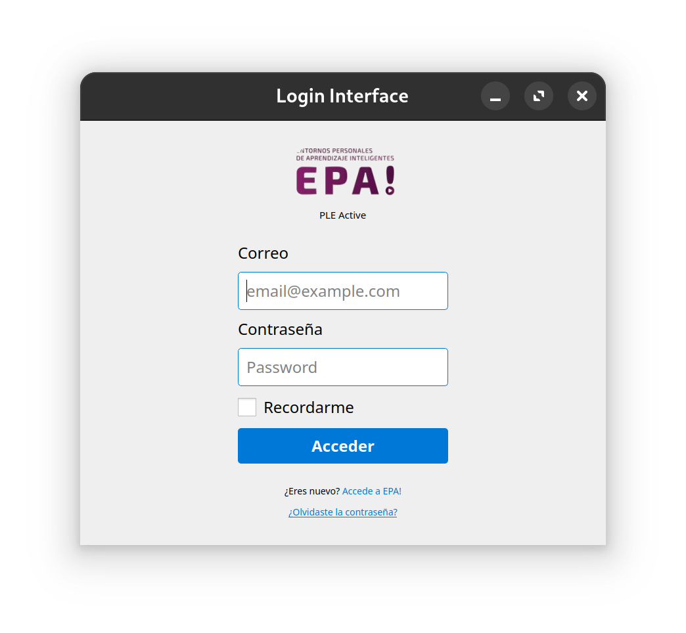
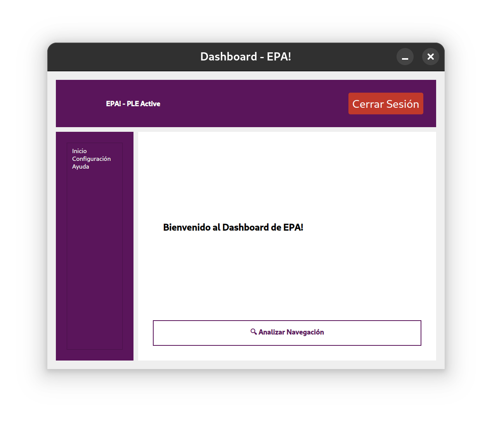

# EPAI - Entorno Personal de Aprendizaje Inteligente

EPAI es una aplicación de escritorio que permite a docentes y estudiantes crear, personalizar y gestionar sus Entornos Personales de Aprendizaje (PLE). El sistema integra análisis inteligente del historial de navegación de Chrome mediante técnicas de NLP para generar recomendaciones adaptativas y facilitar la mejora continua de competencias.

## Arquitectura

La aplicación utiliza una arquitectura híbrida:

```
┌─────────────────┐       HTTP        ┌─────────────────┐
│   PyQt5 GUI     │ ◄──────────────►  │  Flask Backend   │
│  (hilo principal)│   localhost:5000  │  (hilo separado) │
└────────┬────────┘                   └────────┬─────────┘
         │                                     │
         │                            ┌────────┴─────────┐
         │                            │   SQLite (local)  │
         │                            └────────┬─────────┘
         │                                     │
         └──────────────┬──────────────────────┘
                        │
              ┌─────────┴──────────┐
              │  UniNova API       │
              │  (autenticación +  │
              │   sincronización)  │
              └────────────────────┘
```

## Funcionalidades

### Autenticación
- Inicio de sesión externo a través de la plataforma UniNova (Drupal)
- Extracción automática del perfil de usuario
- Registro local con hash de contraseñas (bcrypt)

### Gestión de PLE
- Visualización de PLEs asignados al usuario (mosaico/lista)
- Configuración de preferencias por PLE (almacenamiento local y remoto)
- Navegación entre secciones: Inicio, Preferencias, Cambiar PLE

### Integración con Chrome
- Detección automática de perfiles de Chrome (Windows, macOS, Linux)
- Extracción del historial de navegación (lectura directa de SQLite)
- Análisis de avatares de perfil (local y en la nube)

### Extracción de Keywords (NLP)
El sistema emplea 4 métodos de extracción ejecutados en paralelo:

| Método | Tipo | Descripción |
|--------|------|-------------|
| **RAKE** | Estadístico | Rapid Automatic Keyword Extraction |
| **KeyBERT** | Transformers | Embeddings semánticos con sentence-transformers |
| **YAKE** | Estadístico | Yet Another Keyword Extractor |
| **spaCy** | Lingüístico | Noun chunks + Named Entity Recognition |

- Soporte multilingüe: español, inglés y portugués
- Análisis de frecuencia y relevancia de keywords
- Procesamiento no bloqueante con threads Qt

### Sincronización API
- Envío de datos de seguimiento a `uninovadeplan-ws.javali.pt/tracked-data-batch`
- Manejo seguro de threads con Qt signals/slots
- Feedback visual con overlays de progreso y batch IDs

## Estructura del Proyecto

```
├── main.py                          # Punto de entrada de la aplicación
├── requirements.txt                 # Dependencias de Python
├── config/
│   ├── config.py                    # Configuración (DB, API, rutas, autenticación)
│   └── preferenciasPorPLE/          # Preferencias locales por usuario y PLE
├── app/                             # Backend Flask
│   ├── __init__.py                  # Factory de la app Flask
│   ├── database.py                  # Inicialización de SQLAlchemy
│   ├── models.py                    # Modelos: User, Role, Permission, WebTracking, WebHistory
│   ├── auth/
│   │   ├── login.py                 # Autenticación contra UniNova
│   │   └── signup.py                # Registro de usuarios locales
│   ├── chrome/
│   │   ├── routes.py                # Endpoints: /chrome/profiles, /chrome/keywords/<profile>
│   │   └── service.py              # Extracción de historial y keywords con NLP
│   └── utils/
│       └── utils.py                 # Funciones utilitarias
├── qt_views/                        # Interfaz gráfica PyQt5
│   ├── login_interface.py           # Ventana de inicio de sesión
│   ├── DashboardWindow.py           # Ventana principal del dashboard
│   ├── ProfileWindow.py             # Selección de perfil de Chrome
│   ├── dashboard.py                 # Contenido dinámico del dashboard
│   ├── global_state.py              # Estado global de la aplicación
│   ├── components/
│   │   ├── Header.py                # Barra superior con logo, avatar y logout
│   │   └── Sidebar.py              # Menú lateral con navegación y lista de PLEs
│   └── ple/
│       ├── PLEView.py               # Interfaz principal de gestión de PLE
│       ├── SitesKeywordsSyncWidget.py  # Extracción de keywords y sincronización
│       └── SyncSummaryWidget.py     # Resumen de resultados de sincronización
├── services/
│   ├── api_service.py               # Cliente HTTP para la API de UniNova
│   ├── history_service_1.py         # Análisis de historial de Chrome (v1)
│   └── history_service_4.py         # Análisis de historial de Chrome (v4)
├── assets/                          # Recursos estáticos (logos, imágenes)
├── Documentation/                   # Documentación de builds y despliegue
├── build_mac.py                     # Script de build para macOS (.app/.dmg)
├── build_exe_fixed.py               # Script de build para Windows (.exe)
└── EPA_Dashboard.spec               # Spec de PyInstaller para macOS
```

## Requisitos

- Python 3.9+
- Google Chrome (para la funcionalidad de extracción de historial)

## Instalación

### 1. Clonar el repositorio

```bash
git clone https://github.com/danielmares32/EPAIUAA.git
cd EPAIUAA
```

### 2. Crear el entorno virtual

```bash
python -m venv venv
source venv/bin/activate      # Linux/macOS
venv\Scripts\activate         # Windows
```

### 3. Instalar dependencias

```bash
pip install -r requirements.txt
```

### 4. Descargar modelo de spaCy

```bash
python -m spacy download es_core_news_sm
```

### 5. Configurar token de acceso

Crear un archivo `secret.txt` en la raíz del proyecto con el token de la API, o definir la variable de entorno:

```bash
export API_ACCESS_TOKEN="tu_token_aquí"
```

### 6. Ejecutar la aplicación

```bash
python main.py
```

> En Linux puede ser necesario ejecutar con `sudo` para acceder a ciertos recursos del sistema.

## API Endpoints (Flask local)

| Método | Endpoint | Descripción |
|--------|----------|-------------|
| `POST` | `/signup` | Registro de usuario local |
| `POST` | `/auth/login` | Autenticación contra UniNova |
| `GET` | `/chrome/profiles` | Listar perfiles de Chrome disponibles |
| `GET` | `/chrome/keywords/<profile>` | Extraer keywords de un perfil |

### Ejemplos con cURL

**Registro de usuario:**
```bash
curl -X POST http://127.0.0.1:5000/signup \
  -H 'Content-Type: application/json' \
  -d '{"nombre": "Juan", "apellido": "Pérez", "usuario": "jperez", "contrasena": "password123"}'
```

**Listar perfiles de Chrome:**
```bash
curl http://127.0.0.1:5000/chrome/profiles
```

**Extraer keywords:**
```bash
curl http://127.0.0.1:5000/chrome/keywords/Default
```

## Stack Tecnológico

| Categoría | Tecnologías |
|-----------|-------------|
| **Backend** | Flask 3.1, SQLAlchemy 2.0, Flask-SQLAlchemy |
| **Frontend** | PyQt5 5.15 |
| **NLP** | spaCy 3.8, KeyBERT 0.9, RAKE-NLTK, YAKE 0.6 |
| **ML/DL** | PyTorch 2.7, Transformers 4.53, sentence-transformers 5.0, scikit-learn 1.7 |
| **Seguridad** | bcrypt 4.3 |
| **Web Scraping** | Selenium 4.34, BeautifulSoup4, Scrapy 2.12 |
| **Red** | Scapy 2.6 |

## Soporte Multiplataforma

| Sistema | Directorio de datos | Build |
|---------|-------------------|-------|
| **Windows** | `%APPDATA%/EPA Dashboard` | `python build_exe_fixed.py` |
| **macOS** | `~/Library/Application Support/EPA Dashboard` | `python build_mac.py` |
| **Linux** | `~/.config/EPA Dashboard` | — |

## Capturas de Pantalla

### Login


### Dashboard

